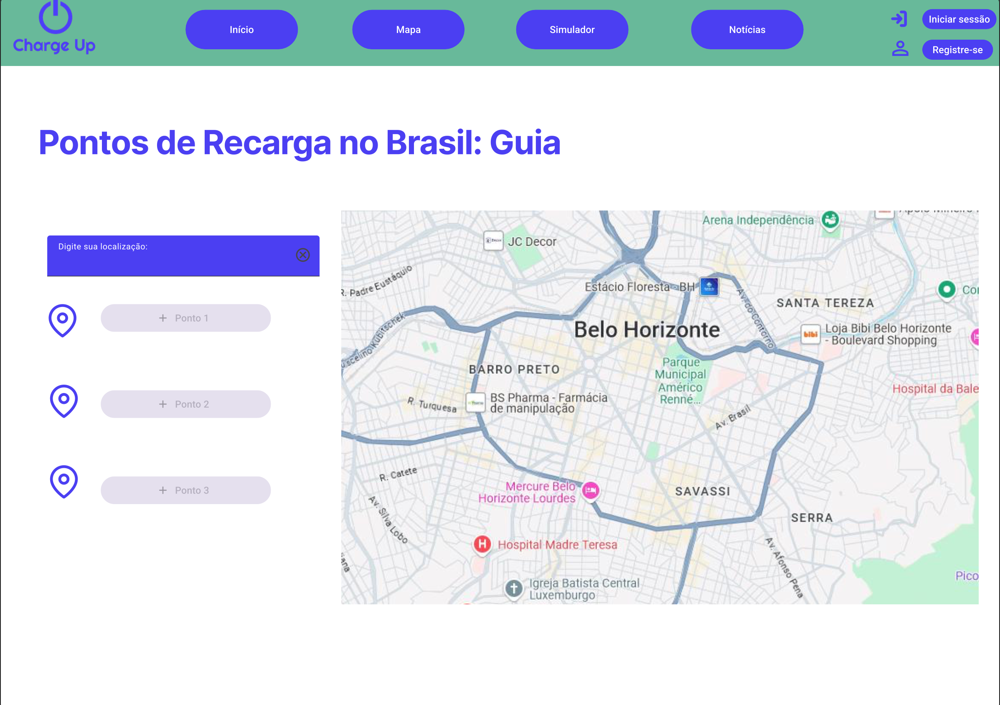
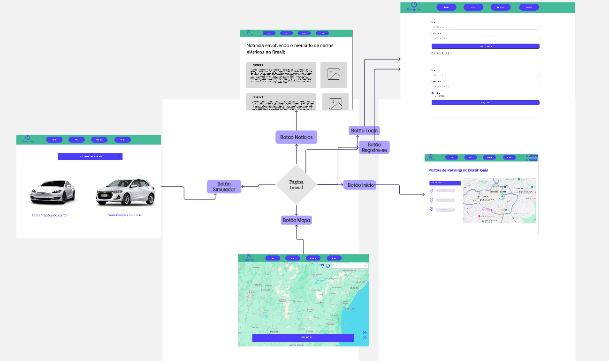

# Introdução

Informações básicas do projeto.

* **Projeto:** [Falta de incentivo à carros elétricos]
* **Repositório GitHub:** [Link](https://github.com/ICEI-PUC-Minas-PPLCC-TI/ti-1-ppl-cc-m-2024-2-g14-carros-eletricos)
* **Membros da equipe:**

  * [Henrique Gonçalves Pimenta Velloso](https://github.com/osohenri)
  * [João Vitor de Alvarenga Alvares](https://github.com/joaovitoralvarenga)
  * [Lucca Sander Frisso](https://github.com/Lsanderf)
  * [Luciano Gomes Eudes](https://github.com/llucianoeudes)
  * [Ernando Gabriel Antunes de Oliveira](https://github.com/ErnandoGA)

A documentação do projeto é estruturada da seguinte forma:

1. Introdução
2. Contexto
3. Product Discovery
4. Product Design
5. Metodologia
6. Solução
7. Referências Bibliográficas

[Documentação de Design Thinking (MIRO)](files/Miro.pdf)

# Contexto

A falta de incentivo à carros elétricos, principalmente quando se trata da infraestrutura de carregamento, ainda é uma barreira gigantesca para o crescimento desse mercado no Brasil. Assim, o projeto visa desenvolver um site que facilite o rastreamento de pontos de carregamento, fornecendo informações em tempo real sobre a localização, disponibilidade, tipo de conector e tarifas, além de educar o público sobre os benefícios dos veículos elétricos. A plataforma é direcionada, sobretudo, à proprietários e potenciais compradores de carros elétricos.

## Problema

* O suporte de infraestrutura para veículos elétricos, especialmente no Brasil, é baixa;

* Proprietários e potenciais compradores de veículos elétricos sentem dificuldade ao localizar pontos de carregamento baratos, bons e próximos;

* A infraestrutura inadequada agrava o problema;

* A demanda por serviços de carregamento de veículos elétricos aumenta em cidades maiores.

## Objetivos

* O objetivo geral deste projeto é desenvolver um software que solucione o problema da falta de infraestrutura e informação para proprietários e potenciais compradores de carros elétricos:

  * Facilitar o acesso a pontos de carregamento;

  * Facilitar o acesso a informações sobre incentivos;

* Entre os objetivos específicos, destacam-se:

  * Criar uma plataforma capaz de rastrear, em tempo real, a localização e a disponibilidade de estações de carregamento;

  * Planejamento de rotas com estações de recarga;

  * Oferecer dados detalhados como tipo de conector e custo;

  * Simulador de viabilidade econômica;

  * Tabela de preços.

## Justificativa

A escolha deste assunto é motivada pela falta de infraestrutura adequada para veículos elétricos, dificultando a adoção desses veículos. O objetivo é desenvolver uma aplicação que facilitaria o acesso às estações de carregamento e forneceria informações sobre subsídios e incentivos para ajudar os clientes e fazer do uso de carros elétricos uma decisão mais aberta e fácil. Destinada a consumidores, a solução será embasada em questionários e resultados estatísticos para entender o que é essencial para o público.

## Público-Alvo

* Proprietários de carros elétricos: Usuários que já possuem veículos elétricos e buscam facilitar seu uso diário;

* Potenciais compradores: Pessoas interessadas em adquirir veículos elétricos, mas que estão em fase de pesquisa sobre a viabilidade prática e os benefícios financeiros.

# Product Discovery

## Etapa de Entendimento

## Etapa de Definição

### Personas

#### Persona 1

#### Persona 2

#### Persona 3

# Product Design

## Histórias de Usuários

Com base na análise das personas foram identificadas as seguintes histórias de usuários:

| EU COMO...                                      | QUERO/PRECISO ...                                                | PARA ...                                       |
| ----------------------------------------------- |  --------------------------------------------------------------- | ---------------------------------------------- |
| Proprietário de carro elétrico                  | Saber onde existem pontos de recarga                             | Fazer viagens longas com mais segurança        |
| Potencial comprador de carro elétrico           | Ter noção de custos e opções de compra de um carro               | Calcular o custo-benefício                     |
| Potencial comprador de carro elétrico           | Entender as vantagens de adotar um carro elétrico                | Sentir que estou fazendo um bom negócio        |
| Proprietário de carro elétrico com dificuldades | Otimizar minha rotina                                            | Minimizar as necessidades de carregamento      |
| Potencial comprador de carro elétrico           | Motivação para considerar a troca do carro atual por um elétrico | Contribuir para um futuro mais sustentável     |
| Potencial comprador de carro elétrico           | Ver a quantidade de pontos de recarga na minha região            | Avaliar se minhas necessidades serão atendidas |

## Proposta de Valor

##### Proposta para Persona 1

##### Proposta para Persona 2

##### Proposta para Persona 3

## Requisitos

### Requisitos Funcionais

| ID     | Descrição do Requisito                                                | Prioridade |
| ------ | --------------------------------------------------------------------- | ---------- |
| RF-001 | Mapeamento dos pontos de recarga                                      | ALTA       |
| RF-002 | Planejamento de rotas com estações de recarga                         | ALTA       |
| RF-003 | Notícias relacionadas a carros elétricos                              | MÉDIA      |
| RF-004 | Notificações personalizadas                                           | MÉDIA      |
| RF-005 | Simulador de viabilidade econômica                                    | ALTA       |
| RF-006 | Tabela de preços dos carros                                           | ALTA       |
| RF-007 | Integração com navegação GPS                                          | ALTA       |
| RF-008 | Comparador de postos                                                  | MÉDIA      |
| RF-009 | Monitoramento de disponibilidade em tempo real                        | ALTA       |
| RF-010 | Avaliações e rankings de postos de recarga                            | MÉDIA      |

### Requisitos não Funcionais

| ID      | Descrição do Requisito                                               | Prioridade |
| ------- | -------------------------------------------------------------------- | ---------- |
| RNF-001 | API do Google Maps                                                   | ALTA       |
| RNF-002 | Site publicado no GitHub                                             | MÉDIA      |
| RNF-003 | Tempo de carregamento reduzido                                       | ALTA       |

## Projeto de Interface

### Wireframes

Estes são os protótipos de telas do sistema.

[Wireframe](files/WireFrame-site.pdf)

### User Flow

### Protótipo Interativo

[Protótipo Interativo (Figma)](https://www.figma.com/proto/Db3a9lAYporz5eRuvVD9oo/Untitled?node-id=1-2&node-type=frame&t=zbMoVCMuXUDCSrcZ-1&scaling=min-zoom&content-scaling=fixed&page-id=0%3A1&starting-point-node-id=1%3A2)

# Metodologia

## Ferramentas

| Ambiente                    | Plataforma          | Link de acesso                                                                       |
| --------------------------- | ------------------- | ------------------------------------------------------------------------------------ |
| Editor de código            | Visual Studio Code  | https://code.visualstudio.com                                                        |
| Repositório de código       | GitHub              | https://github.com/                                                                  |
| Comunicação em equipe       | Discord             | https://discord.com                                                                  |
| Diagramação e prototipagem  | Figma               | https://www.figma.com                                                                |
| Processo de Design Thinking | Miro                | https://miro.com                                                                     |
| Hospedagem do site          | GitHub Pages        | https://pages.github.com                                                             |
| API de mapas                | Google Maps API     | https://developers.google.com/maps                                                   |

## Gerenciamento do Projeto

## Referências

As referências utilizadas no trabalho foram:

* Documentação de ferramentas

  * [Google Maps API](https://developers.google.com/maps)

  * [GitHub Docs](https://pages.github.com)

* Ferramentas e plataformas
  
  * [Figma](https://www.figma.com)  